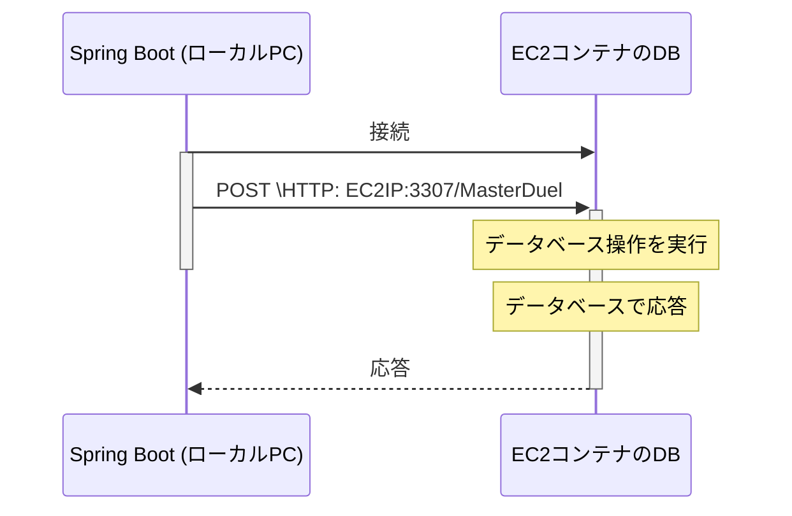

```mermaid
sequenceDiagram
    participant LocalPC as Spring Boot (ローカルPC)
    participant DBContainer as EC2コンテナのDB

    LocalPC->>DBContainer: 接続

    activate LocalPC
    LocalPC->>+DBContainer: POST \HTTP: EC2IP:3307/MasterDuel
    Note over DBContainer: データベース操作を実行
    deactivate LocalPC
    Note over DBContainer: データベースで応答
    DBContainer-->>-LocalPC: 応答
```